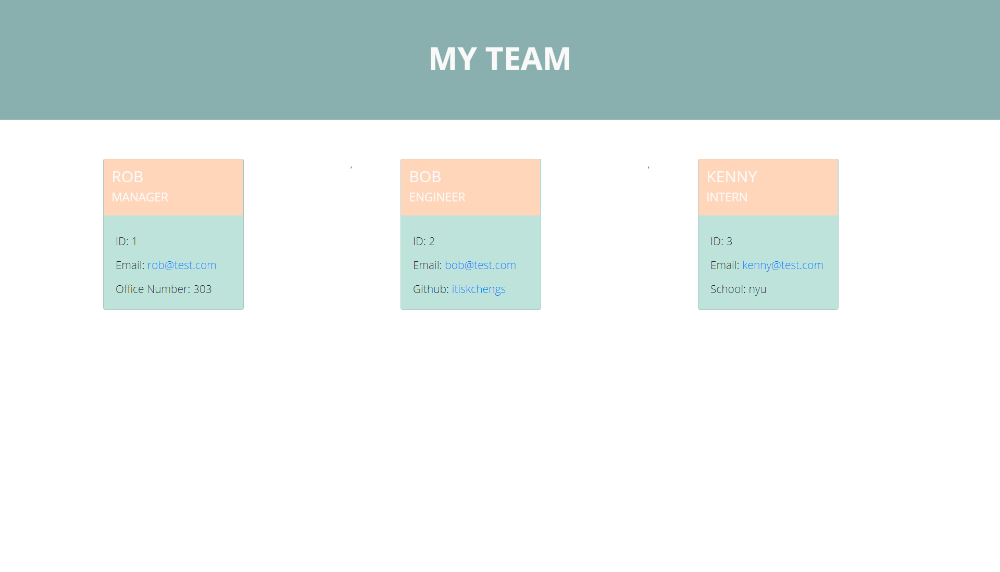

# 10-Object-Oriented-Programming-Team-Profile-Generator

In this homework I created a team profile generator from scratch. For this homework I used inquirer for the questions in command line and used jest for unit testing. I created all the test for each constructor function and there prototype methods. I created constructor functions for each role. The parent employee constructor, then the manager constructor, the intern constructor and the engineer constructor. Then I created the html template that uses all the information from the constructor functions. When the app is ran and when you have added all the roles you want you are then present with an output html file that has all the information that you have added.

# Screenshot
 

 

# Video Link

https://drive.google.com/file/d/1j-Rh-yHUKcQ6zeGpLfMPhgjXk8T6Gf2f/view